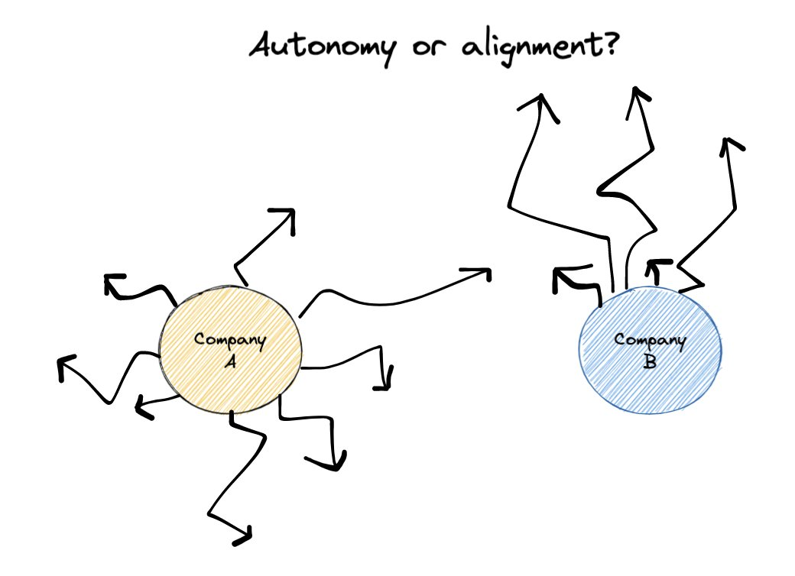
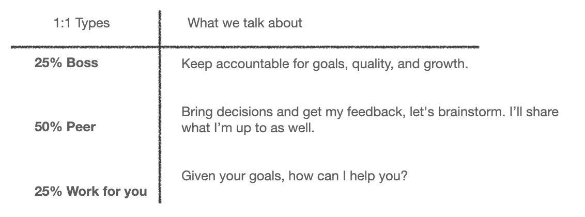

Jean-Michel Lemieux ([@jmwind](https://twitter.com/jmwind))

Another common question I’m answering working with scaling tech companies is…

Q. What’s the worst leadership advice you’ve heard?

A. By far the worst is “Hire great people and get out of their way”. 

Let me explain… 🧵 (1/32) [pic.twitter.com/5X9U9uLCre](https://twitter.com/jmwind/status/1493569303030816770/photo/1)

[Tweet link](https://twitter.com/jmwind/status/1493569303030816770)

---

Jean-Michel Lemieux ([@jmwind](https://twitter.com/jmwind))

2/ After a year leading engineering at Atlassian [@scottfarkas](https://twitter.com/scottfarkas) told me in my perf review that I was doing ok but wondered why I didn’t talk and involve him more regularly.

[Tweet link](https://twitter.com/jmwind/status/1493569306067554308)

---

Jean-Michel Lemieux ([@jmwind](https://twitter.com/jmwind))

3/ My answer was “I thought that was my job — to take away all this crap from you and let you do your CEO thing. I thought you wanted me to be autonomous. I need autonomy.” 

He said sure, but you should cheat “and use my brain to help you”

[Tweet link](https://twitter.com/jmwind/status/1493569308798054409)

---

Jean-Michel Lemieux ([@jmwind](https://twitter.com/jmwind))

4/ At that point I changed some habits, involved him more in different ways, got over the autonomy complex, and we got a lot more done together. I learned a lot and we made better decisions.

[Tweet link](https://twitter.com/jmwind/status/1493569311599853568)

---

Jean-Michel Lemieux ([@jmwind](https://twitter.com/jmwind))

5/ Since then I've hired many leaders and had to repeat the same conversation that [@scottfarkas](https://twitter.com/scottfarkas) had with me over and over and over. 

Most people default to expect the wrong version of autonomy.

[Tweet link](https://twitter.com/jmwind/status/1493569314426798089)

---

Jean-Michel Lemieux ([@jmwind](https://twitter.com/jmwind))

6/ These experiences sent me down a multi-year reflection. 

Why did I feel like success was maximizing autonomy and showing that I could take care of things without bugging my boss?

[Tweet link](https://twitter.com/jmwind/status/1493569317568352258)

---

Jean-Michel Lemieux ([@jmwind](https://twitter.com/jmwind))

7/ I prioritized autonomy over alignment. 

It's a million times easier to measure and feel high autonomy than it is to measure high alignment.

[Tweet link](https://twitter.com/jmwind/status/1493569321045413889)

---

Jean-Michel Lemieux ([@jmwind](https://twitter.com/jmwind))

8/ What I've learned since, way too slowly, is that companies are performing a monumental balancing act trying to decide what 98% of their problem space to focus, what to ignore, and how to ship.

That’s your strategy. And it’s complex, ambiguous, and changing.

[Tweet link](https://twitter.com/jmwind/status/1493569323969007617)

---

Jean-Michel Lemieux ([@jmwind](https://twitter.com/jmwind))

9/ The hardest part of building a company is alignment on strategy and clearly communicating it. 

Think about it this way, a 1 degree deviation in course of a rocket heading to the sun means it will miss the sun by 

1.2 million miles. 

A lack of alignment compounds quickly.

[Tweet link](https://twitter.com/jmwind/status/1493569326841876483)

---

Jean-Michel Lemieux ([@jmwind](https://twitter.com/jmwind))

10/ Every leader in the company is trying to keep on course using the strategy as a compass… and readjusting as new information comes in.

[Tweet link](https://twitter.com/jmwind/status/1493569329685680129)

---

Jean-Michel Lemieux ([@jmwind](https://twitter.com/jmwind))

11/ You're never confronted with problems that are independent of each other. Your problems are part of a complex systems &amp; interact with each other. 

Situational messes. 

Much of the alignment process is understanding the mess with others. And then simplifying it and focusing.

[Tweet link](https://twitter.com/jmwind/status/1493569332474892290)

---

Jean-Michel Lemieux ([@jmwind](https://twitter.com/jmwind))

12/ Alignment the difference between progress and stagnation.

You need a good level of alignment on everything, from culture and architecture to which customers to build for which to not build for. [pic.twitter.com/fGBPf1V7Bs](https://twitter.com/jmwind/status/1493569342344105989/photo/1)

[Tweet link](https://twitter.com/jmwind/status/1493569342344105989)

---

Jean-Michel Lemieux ([@jmwind](https://twitter.com/jmwind))

13/ And here's the hard part...the second you leave an alignment meeting, you’re mis-aligned again. That’s fine, it’s normal. 

Alignment decays incredibly quickly.

[Tweet link](https://twitter.com/jmwind/status/1493569345489752066)

---

Jean-Michel Lemieux ([@jmwind](https://twitter.com/jmwind))

14/ There's mass confusion on what to align on? 

Most people just want to know the very high level goals.

And this causes most companies that I work with to align superficially. Their strategy is a superficial incomplete map, they don't remove scope, communicate clearly, etc...

[Tweet link](https://twitter.com/jmwind/status/1493569348220305411)

---

Jean-Michel Lemieux ([@jmwind](https://twitter.com/jmwind))

15/ Here’s an example. If you want to sail a boat across the Atlantic, what is your strategy? 

Strategy 1: Leave from Portugal and head towards St Lucie and not die. And have fun!

But that’s not a strategy...

[Tweet link](https://twitter.com/jmwind/status/1493569350984372226)

---

Jean-Michel Lemieux ([@jmwind](https://twitter.com/jmwind))

16/ Strategy 2: when do we leave and why? What kind of boat and why? What systems do you have &amp; backups, how many crew, sail selection, route planning options? 

Strategy is multi-faceted and evolving. 

You can discuss this strategy in depth, but not do the trip together.

[Tweet link](https://twitter.com/jmwind/status/1493569353773506562)

---

Jean-Michel Lemieux ([@jmwind](https://twitter.com/jmwind))

17/ The biggest alignment problem is the gap between how much people think they have to align versus what they should align on. 

There are many strategic decisions in the "how". eg, what technologies to use, new system vs integration, build in core or in an app. [pic.twitter.com/6lmIkvNryk](https://twitter.com/jmwind/status/1493569361621176323/photo/1)

[Tweet link](https://twitter.com/jmwind/status/1493569361621176323)

---

Jean-Michel Lemieux ([@jmwind](https://twitter.com/jmwind))

18/ Alignment forces you to talk with your boss and peers to:

- define a strategy, narrow focus

- communicate it clearly together 

- and ensure you're hired enough people who "get it" and can fill in the implementation details with their teams

[Tweet link](https://twitter.com/jmwind/status/1493569365140115459)

---

Jean-Michel Lemieux ([@jmwind](https://twitter.com/jmwind))

19/ So...when you hire someone or you have a new leader, your number one job is alignment. And you do this continuously. 

It’s definitely never going to be “hire them and get out of their way”.

[Tweet link](https://twitter.com/jmwind/status/1493569368222945283)

---

Jean-Michel Lemieux ([@jmwind](https://twitter.com/jmwind))

20/ There is so much research on pair programming, yet we don’t have the same cultural acceptance of pairing in leadership. 

But paired leadership is mandatory. 

[researchgate.net/publication/27…](https://www.researchgate.net/publication/27295641_The_Case_for_Collaborative_Programming)

[Tweet link](https://twitter.com/jmwind/status/1493569371146391557)

---

Jean-Michel Lemieux ([@jmwind](https://twitter.com/jmwind))

21/ But why are we in this predicament of worshipping autonomy more than alignment?

[Tweet link](https://twitter.com/jmwind/status/1493569374128463877)

---

Jean-Michel Lemieux ([@jmwind](https://twitter.com/jmwind))

22/ I know what you're thinking. Isn't this micro-managing? 

It isn't. 

[@scottfarkas](https://twitter.com/scottfarkas) and [@tobi](https://twitter.com/tobi) let me run the team and implement our strategy fully. 

But together we frequently dug into the “how” to understand and navigate the nuances of our strategy together and often.

[Tweet link](https://twitter.com/jmwind/status/1493569377974710284)

---

Jean-Michel Lemieux ([@jmwind](https://twitter.com/jmwind))

23/ Tech companies worship autonomy to distance themselves from any inkling of command-and-control. 

If you get labelled as micro-managing you're burnt at the stake. 

But the nuances or organizational problem solving has been lost. 

Without alignment, autonomy is squandered.

[Tweet link](https://twitter.com/jmwind/status/1493569381669822469)

---

Jean-Michel Lemieux ([@jmwind](https://twitter.com/jmwind))

24/ Even after all this, I messed up again in 2015 when starting at Shopify. [@tobi](https://twitter.com/tobi) gave me the same feedback again… I’m a slow learner.

At that point I told myself... You HAVE to take responsibility for alignment. It’s YOUR job, as much as your bosses.

[Tweet link](https://twitter.com/jmwind/status/1493569384433913862)

---

Jean-Michel Lemieux ([@jmwind](https://twitter.com/jmwind))

25/ I've became very upfront about alignment with new hires. Gist of our first conversation is:

"We're going to spend more time pairing and going deep on strategy and decisions than you're used to... we have a lot to learn from each other...but you'll own the implementation."

[Tweet link](https://twitter.com/jmwind/status/1493569387239907331)

---

Jean-Michel Lemieux ([@jmwind](https://twitter.com/jmwind))

26/ ...and then I'll share these 3 alignment tips with them that we can use together:

✅ Role allocation model 

✅ Decision tree model

✅ Alignment habits

[Tweet link](https://twitter.com/jmwind/status/1493569390003978250)

---

Jean-Michel Lemieux ([@jmwind](https://twitter.com/jmwind))

27/ First tip, be clear and open about the types of conversations you need with your direct reports:

25% of my time your boss,

50% your peer,

25% I work for you

This encourages collaboration and sets the tone of alignment and a strong habit of working together. [pic.twitter.com/eZcHF9ruEh](https://twitter.com/jmwind/status/1493569398212157443/photo/1)

[Tweet link](https://twitter.com/jmwind/status/1493569398212157443)

---

Jean-Michel Lemieux ([@jmwind](https://twitter.com/jmwind))

28/ Second tip: Susan Scott, author of “Fierce Conversations,” offers a wonderful alignment model: the Decision Tree. [pic.twitter.com/bLfbT9TdzV](https://twitter.com/jmwind/status/1493569408236617731/photo/1)

[Tweet link](https://twitter.com/jmwind/status/1493569408236617731)

---

Jean-Michel Lemieux ([@jmwind](https://twitter.com/jmwind))

29/ The decision tree is great as it's a reminder that you don't have to align on everything. 

Decisions have different costs to unwind. Spend time alignment based on the impact of the decisions.

[Tweet link](https://twitter.com/jmwind/status/1493569411633926149)

---

Jean-Michel Lemieux ([@jmwind](https://twitter.com/jmwind))

30/ Third tip: take FULL responsibility for alignment with your boss and peers.

Send your boss at minimum 2 async notes a week. Decisions, wins, lessons, how you’re doing. Schedule it in your calendar. 

Seek feedback, but share decision logic not just outcomes.

[Tweet link](https://twitter.com/jmwind/status/1493569414377062400)

---

Jean-Michel Lemieux ([@jmwind](https://twitter.com/jmwind))

31/ Feel responsible, take ownership of alignment. Don’t blame the process. It takes active work to build and maintain. You'll make better decisions.

[Tweet link](https://twitter.com/jmwind/status/1493569417149435909)

---

Jean-Michel Lemieux ([@jmwind](https://twitter.com/jmwind))

32/ Netflix's slogan of "highly aligned, loosely coupled" was spot on. 

But it's a lot harder to implement than you think. 

Without alignment, autonomy is squandered.

So hire great people, and expect highly coupled frequent alignment with loosely coupled implementation.

/end

[Tweet link](https://twitter.com/jmwind/status/1493569419980673026)